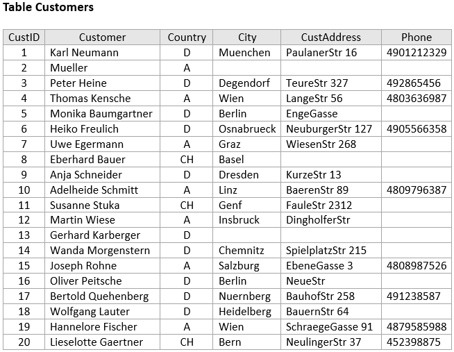
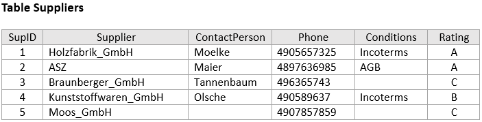
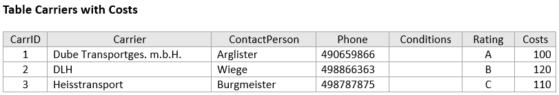
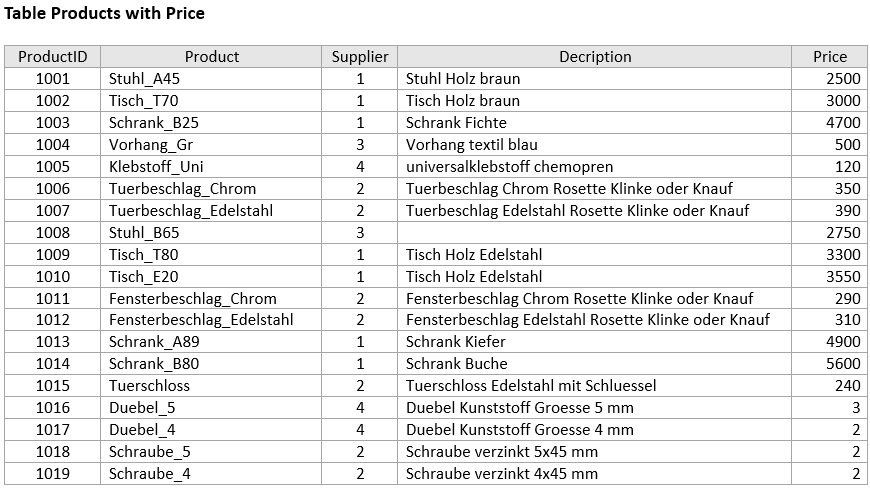
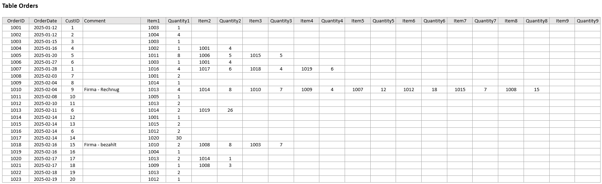
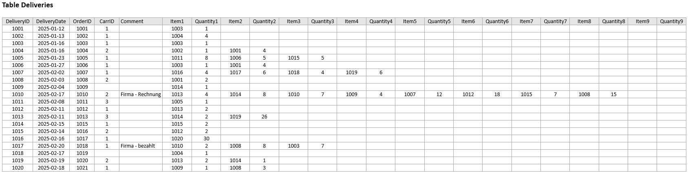
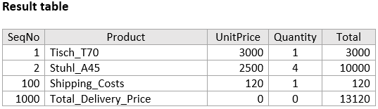
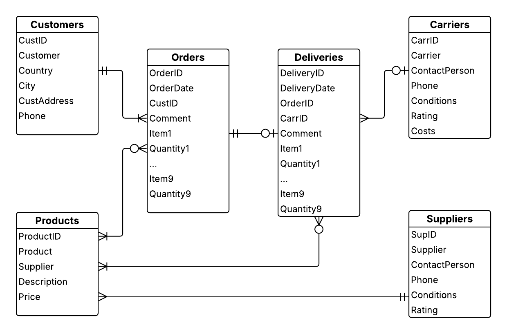

# SQL Project

## Overview

This project demonstrates the creation and upating of tables in my Azure DB (MS SQL), insertion of data, and queries. It also includes an ER diagram representing the entity relationships within the database.

## Files

There are 4 SQL files in this project. 

- The first file contains the code to create 6 tables ( [1_Creating_tables.sql](1_Creating_tables.sql) ): 

    - Customers - contains customer ID, name and other data of each customer,
    - Suppliers - ID, name and other data of each supplier,
    - Carriers - ID, name and other data of each carrier, shipping costs are added later,
    - Products - ID, product name, description, prices are added later,
    - Orders - contains order ID, customer ID, date and comment, order items are handled by 9 columns for product ID and 9 columns for quantity of each item,
    - Deliveries - delivery ID, order ID, forwarder ID, date and comment, and then items and quantity as in the Orders table.

- The second file is used to insert data into the created tables ( [2_Inserting_data.sql](2_Inserting_data.sql) ).

- The third file updates two tables by adding another column, modifying constraints and inserting data ( [3_Adding_column.sql](3_Adding_column.sql) ).

- The fourth file is a select script that displays data from several tables using JOINS to display a specific delivery, listing the items not in columns but in rows (using CROSS APLY as UnpivotTable) and two additional rows with the shipping cost and total price of the delivery (using UNION) ( [4_Select_total_price.sql](4_Select_total_price.sql) ).

## Results

- Tables showing data after execution of the first three files:

- Select result table of specific delivery with unit prices, quantity, total prices per item and with shipping costs and total delivery price

## ER Diagram

